<div align="center">



### Learn from each other. Grow together.

**SkillSwap** is a peer-to-peer learning platform where students share skills, teach what they know, and use Skill Credits to learn something new.

[Open SkillSwap](https://joyful-blini-599dc7.netlify.app) · [Supabase setup](SUPABASE_SETUP.md)

</div>

---

## ✨ What you can do

- **Create an account** and manage your profile with Supabase Auth.
- **Share and discover skills** across topics like programming, design, music, and languages.
- **Teach and learn** through skill sessions using Skill Credits instead of money.
- **Keep up with the community** with posts, comments, messages, and notifications.
- **Track your progress** with a dashboard, activity history, and leaderboard.
- Enjoy a responsive dark interface with animated backgrounds and reduced-motion support.

> The landing page includes illustrative demo statistics. Configure Supabase to enable account sign-in and cross-device account data. See the setup guide for database and sync details.

## 🚀 Run it locally

SkillSwap is a static HTML app; it does not need a build step or npm install. It loads Tailwind CSS, Lucide icons, Supabase JS, and fonts from CDNs, so an internet connection is needed.

1. Clone or download this repository.
2. Follow [Supabase setup](SUPABASE_SETUP.md) and check `supabase-config.js` has your project URL and **anon/public** key.
3. From the project folder, start a local web server:

   ```bash
   python -m http.server 8000
   ```

4. Open [http://localhost:8000/SkillSwap_Improved.html](http://localhost:8000/SkillSwap_Improved.html).

You can also open `SkillSwap_Improved.html` directly to explore the interface, but a local server is recommended for authentication and redirects.

## ☁️ Supabase and deployment

The app uses Supabase Auth for accounts and the `profiles` and `account_data` tables for server-side profile and app data, protected by row-level security. The browser's local storage is used as a cache. If two devices update the same account at once, the most recently saved snapshot wins.

To deploy, host `SkillSwap_Improved.html` and `supabase-config.js` together, then set the hosted URL as the Supabase Site URL and an allowed redirect URL. Use the SQL and detailed instructions in [SUPABASE_SETUP.md](SUPABASE_SETUP.md).

**Security:** The Supabase anon/public key is designed for browser use when row-level security is configured. Never put a Supabase `service_role` key in this project or in browser code.

## 🧰 Built with

HTML · CSS · JavaScript · Tailwind CSS CDN · Lucide · Supabase · Netlify

## 📁 Project files

```text
Skillswap/
├── SkillSwap_Improved.html   # App, styles, and client-side logic
├── supabase-config.js        # Supabase project URL and anon/public key
├── SUPABASE_SETUP.md         # Database, auth, and deployment setup
├── README.md
└── skillswap-banner.svg      # Animated README banner
```

## 💜 The idea

Knowledge is currency. SkillSwap makes it easier for students to exchange what they know, discover what they want to learn, and grow together—one skill swap at a time.
